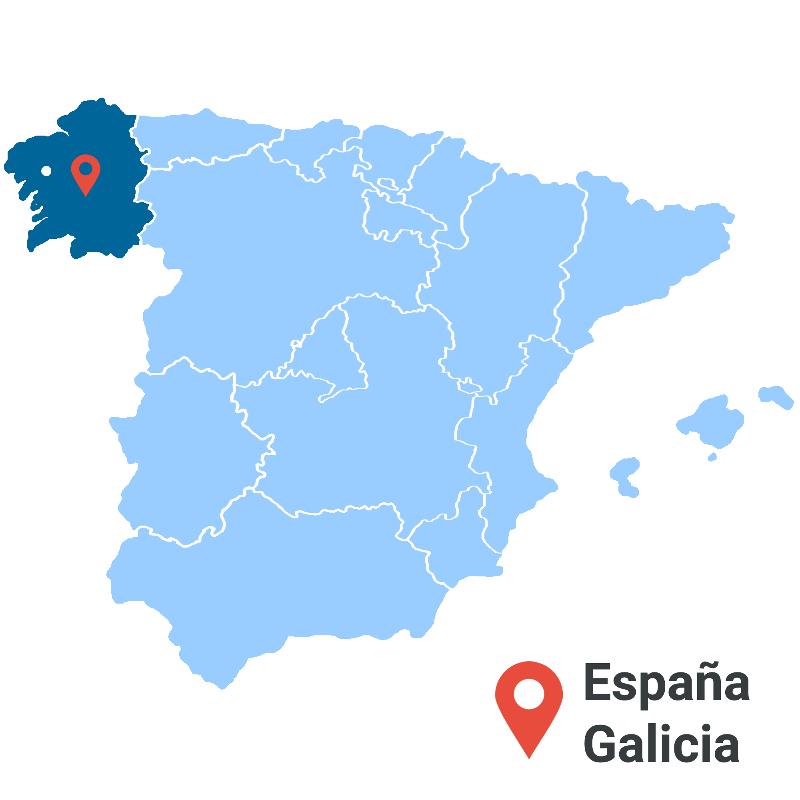

# Predicción de Incendios en Galicia

## Introducción al Proyecto 🚀
_Los incendios forestales, de matorrales o vegetación pueden describirse como cualquier combustión o quema no controlada y no prescrita de plantas en un entorno natural como un bosque, una pradera, etc. Son uno de los mayores problemas ambientales y producen un daño ecológico, económico y humano, irreparables. Por tal motivo una detección prematura de los mismos es una herramienta vital que puede permitir una lucha más eficaz contra este flagelo._

_Hoy en día los incendios forestales suponen un grave problema ecológico, social y económico y se trata de un problema que amenaza con intensificarse debido a los efectos del cambio climático. Poder saber cuándo y dónde se producen, así como cuál es su extensión, a qué vegetación afectan y, sobre todo, por qué se producen y quién o qué los causa, es algo fundamental para evitarlos, protegernos de ellos y así poder conservar nuestro patrimonio forestal._

_Cabe destacar que la recuperación del estrato arbóreo podría demorar aproximadamente 60 años. Desde el punto de vista de las pérdidas económicas derivadas del incendio forestal, se cuentan las pérdidas económicas del bosque, el costo de la extinción del incendio y costo parcial de las pérdidas de infraestructura. Así, las personas residentes permanentes del área quemada, ven perjudicada su calidad de vida, tanto en su salud como en su economía y sus actividades cotidianas, cada vez que acontece dicho siniestro. Por esta razón, un sistema de prevención del fuego que informe de alertas tempranas podría ayudar a solventar muchas de estas pérdidas, alertando a la población y a las autoridades, para que prepare y dirija sus recursos en la posible zona de siniestro, y así evitar al mínimo pérdidas económicas, ecológicas y principalmente pérdidas de vidas humanas._

### Objetivos y tareas📋

_Este proyecto tiene como principal objetivo el obtener un mejor entendimiento de técnicas, desarrollo y construcción de un **modelo de machine learning supervisado**. La realización de tareas de Data Acquisition, Data Wrangling y EDA nos guiarán a la obtención de un modelo fiable, el cual es nuestra meta final._

_Con nuestro modelo de machine learning pretendemos predecir cómo se relacionan las causas de incendios con las distintas variables para poder generar planes eficientes de control del fuego: brindar un sistema de soporte de decisión a la planeación estratégica de recursos destinados a incendios forestales._

_Crear un modelo que ayude en la predicción de desarrollo de incendios a partir de sus causas haría mucho más eficiente la distribución de los recursos necesarios para la extinción y ayudaría también en la reducción de costes, daños y pérdidas. Aún teniendo en cuenta la gran dificultad que presenta el desarrollo de un modelo de predicción de incendios (por su complejidad y ser altamente no lineal debido a la incertidumbre asociada al comportamiento humano en relación al fuego), se intentará desarrollar un modelo basándonos en el histórico de datos de la Región de Galicia que es la de mayor afluencia de incendios en España y de la cual tenemos acceso a un dataset con abundantes registros._
_

### Adquisición de datos (Data Acquisition) :mag:

_Como y de donde obtuvimos el dataset_

_Los datos originales fueron obtenidos de [CIVIO](https://datos.civio.es/dataset/todos-los-incendios-forestales/) y [Aemet](https://opendata.aemet.es/centrodedescargas/productosAEMET), pero estamos utilizando el dataset con un preprocesado mucho más específico y de un nivel mucho más alto, que crearon [LenaMorianu](https://github.com/LenaMorianu) y su equipo._

### Conocimiento y Preparación de datos (Data Wrangling) 🔧

_Preparacion, limpieza, integración y transformación de los datos_

_Ejecutamos códigos para ordenamiento y limpieza de nuestra raw data con el fin de detectar y eliminar errores de registro._
* _Eliminamos columnas innecesarias_
* _Verificamos que todos los datos cuenten con el mismo formato: Transformamos la columna 'fecha' a tipo numerico para luego dividir mejor las variables_

_Una vez establecida la variable 'causa' como variable target de nuestro proyecto, procedimos a la identificación de las variables más relevantes relacionadas con la primera._

* _Agrupamos dentro del dataset según la variable 'causa' –> df.groupby('causa').size()_
* _Mapeamos las variables categoricas que tienen un orden para que sean facilmente adaptables a los modelos._
* _Dado que la variable 'idmunicipio' contiene gran cantidad de 	posibilidades, que decidimos dropear la columna para no agregar varianza a los datos. Latitud y longitud brindan ya la información de ubicación._
* _Dividimos el dataset en dos (datos categoricos y numericos) para optimizar su manejo._
* _Utilizamos catboost para entender la importancia de las variables a la hora de predecir la 'causa'. Observamos que a la hora de elegir una variable temporal, nos resulta conveniente inclinarnos por ‘Trimestre’ ya que es mejor predictor por sobre ‘mes’._

### Exploracion y planificación del modelo (EDA) :microscope:

_Metodos y tecnicas para establecer las relaciones entre las variables_

### Desarrollo del modelo ⚙️

_Evaluar y aplicar las tecnicas para construir el modelo_

## Herramientas utilizadas en el proyecto 🛠️

_Menciona las herramientas que utilizaste para crear tu proyecto_

* [Anaconda](https://www.anaconda.com/) - La distribución usada
* [Scikit-learn](https://scikit-learn.org/) - Libreria usada para el modelo de ML
* [Matplotlib](https://matplotlib.org/) & [Seaborn](https://seaborn.pydata.org/) - Librerias para la visualización de gráficos

## Créditos :handshake:

* Creditos a **Lena Morianu** y a su equipo por el [dataset](https://github.com/LenaMorianu/Los-incendios-en-Galicia) - *Los incendios en Galicia* - [LenaMorianu](https://github.com/LenaMorianu)

## Notas 📌
Ejemplo

## Autores ✒️

* **Alejandro Nuñez** - [AleNunez5](https://github.com/AleNunez5)
* **Carolina Vinagre** - [carovinagre](https://github.com/carovinagre)
* **Claudia Courau** - [clau-courau](https://github.com/clau-courau)
* **Francisco Gutierrez** - [franciscodevs](https://github.com/franciscodevs)

## Tutor :raising_hand_man:
* **Jose Ignacio Lopez Saez** - [nachols1986](https://github.com/nachols1986)

